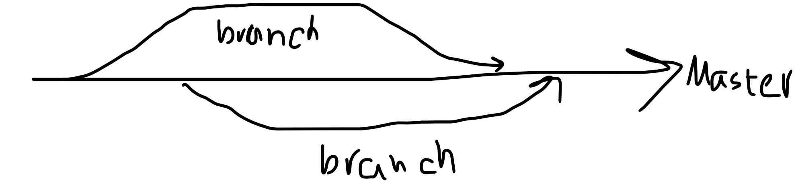

## Session 05: Branches

Branching is a powerful feature in Git that allows you to diverge from the main line of development and work independently without affecting the main line.

Here is a simple diagram illustrating how branches diverge from the master branch:



### Creating a Branch

To create a branch and switch to it:

```bash
~ git branch fixpages
~ git checkout fixpages
```

### Merging a Branch

After you've completed your work on the branch, you can merge it back into the master branch:

```bash
~ git checkout master
~ git merge fixpages
```

### Deleting a Branch

If you've merged a branch and no longer need it, you can delete it:

```bash
~ git branch -d fixpages
```

### Removing a File

If you created a file by mistake or no longer need it:

```bash
~ git rm yourfile.html
```

---

## Session 06: GitHub

Git is a distributed version control system, which means you can keep your repositories in sync across different locations.

### Cloning a Repository

To clone a repository from GitHub:

```bash
~ git clone git@github.com:Sinamahani/git_tut.git
```

### Pushing Changes to GitHub

After making changes to your local repository, you can push them to GitHub:

```bash
~ git push origin master
```

### Pulling Updates from GitHub

To pull the latest changes from GitHub:

```bash
~ git pull origin master
```

### Setting a Remote Repository

If you started a project locally and later decide to push it to GitHub:

```bash
~ git remote add origin your-repository-url.git
```

---

## Session 07: Conflicts

Conflicts occur when two people have made changes to the same part of a file and then try to merge those changes.

### Handling Conflicts

The best way to handle conflicts is to pull the latest changes, resolve the conflicts manually, and then push the resolution:

```bash
~ git pull origin master
# Manually resolve any conflicts in your files
~ git push origin master
```

